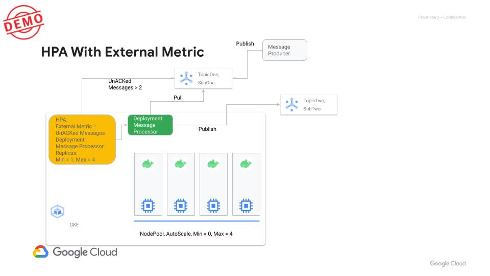
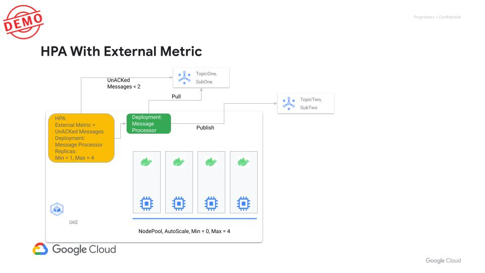
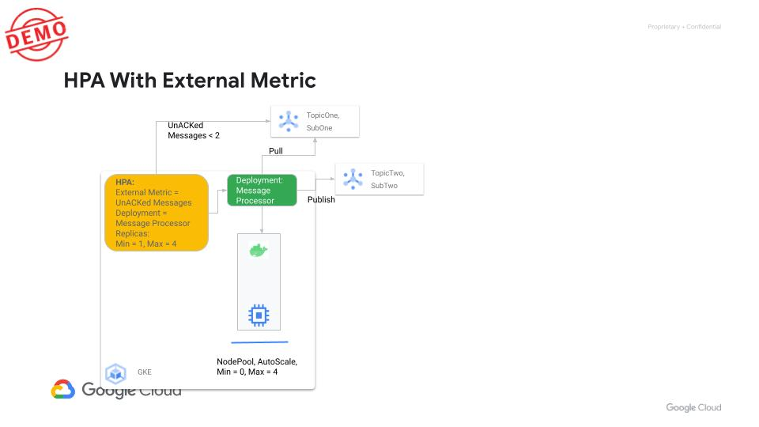

# Use Case 2: Autoscale GKE to using external metric 

## Architecture
We are going to demonstrate the use case using PubSub instead of RabbitMQ. 
Idea is to load messages/jobs to PubSub topic. The GKE app will autoscale to process the messages/jobs.
With pod autoscaling we will also see the Nodes autoscaling. Once all the messages/jobs are processed the pods will scale down to zero.
With that the nodes too will scale down to zero.


Following is the 
 
 
 
 
 


of this demos.


## Prereq
The demo is currently hardcoded to a project name and topics/subscriptions in the project. 
Following is the project name 
- hpc-feb-2023
Following are the topics we need to configure 
- projects/hpc-feb-2023/topics/topic-one
- projects/hpc-feb-2023/topics/topic-two

Following are the subscriptions we need to configure 
- projects/hpc-feb-2023/subscriptions/sub-one
  - Please configure this Subscription to use a Label `subscription_id: sub-one`
- projects/hpc-feb-2023/subscriptions/sub-two

## Logical steps 
1. Create a regular GKE cluster 
2. Setup custom stackdriver metrics
3. Update cluster to use Workload Identity
4. Create a new nodepool for app workload 
5. Setup IAM SA on the new namespace 

## GKE setup
```
. ./setenv
gcloud config set project ${PROJECT_ID}
gcloud container clusters create ${GKE_CLUSTER_NAME} \
       --machine-type=e2-medium \
       --num-nodes=1 \
       --enable-autoscaling --min-nodes "0" --max-nodes "3" \
       --zone=${GCP_ZONE} \
       --project=${PROJECT_ID} \
       --cluster-version "1.24.9-gke.3200" --release-channel "stable" \
       --enable-ip-alias \
       --default-max-pods-per-node 50 \
       --autoscaling-profile optimize-utilization

gcloud container clusters get-credentials ${GKE_CLUSTER_NAME} --zone ${GCP_ZONE} --project ${PROJECT_ID}

gcloud container clusters update ${GKE_CLUSTER_NAME} \
    --zone=${GCP_ZONE} \
    --workload-pool=${PROJECT_ID}.svc.id.goog

gcloud iam service-accounts create ${GCP_SA} \
    --project=${PROJECT_ID}

gcloud projects add-iam-policy-binding ${PROJECT_ID}\
  --member=serviceAccount:${GCP_SA}@${PROJECT_ID}.iam.gserviceaccount.com \
  --role=roles/monitoring.metricWriter \
  --role=roles/pubsub.editor

kubectl create ns burst 

gcloud iam service-accounts add-iam-policy-binding ${GCP_SA}@${PROJECT_ID}.iam.gserviceaccount.com \
    --role roles/iam.workloadIdentityUser \
    --member "serviceAccount:${PROJECT_ID}.svc.id.goog[burst/default]"

kubectl annotate serviceaccount \
  --namespace burst \
  default \
  iam.gke.io/gcp-service-account=${GCP_SA}@${PROJECT_ID}.iam.gserviceaccount.com \
  --overwrite=true

gcloud container node-pools create ${GKE_BURST_POOL} \
       --cluster=${GKE_CLUSTER_NAME} \
       --machine-type=n1-standard-2 \
       --node-labels=gpu=autoscale-to-zero \
       --node-taints=reserved-pool=true:NoSchedule  \
       --num-nodes=0 \
       --enable-autoscaling \
       --min-nodes=0 \
       --max-nodes=4 \
       --zone=${GCP_ZONE} \
       --project=${PROJECT_ID} \
       --node-version=${GKE_VERSION} \
       --workload-metadata=GKE_METADATA

cd k8s
kubectl apply -f hpc-job-processor.yaml -n burst
kubectl apply -f hpc-job-processor-hpa.yaml -n burst
```